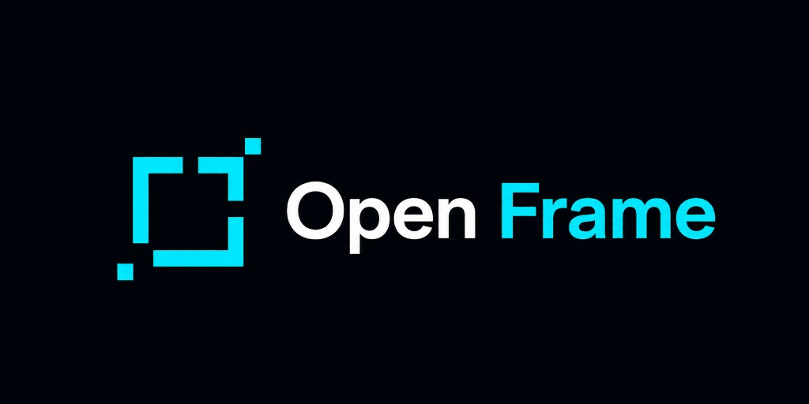
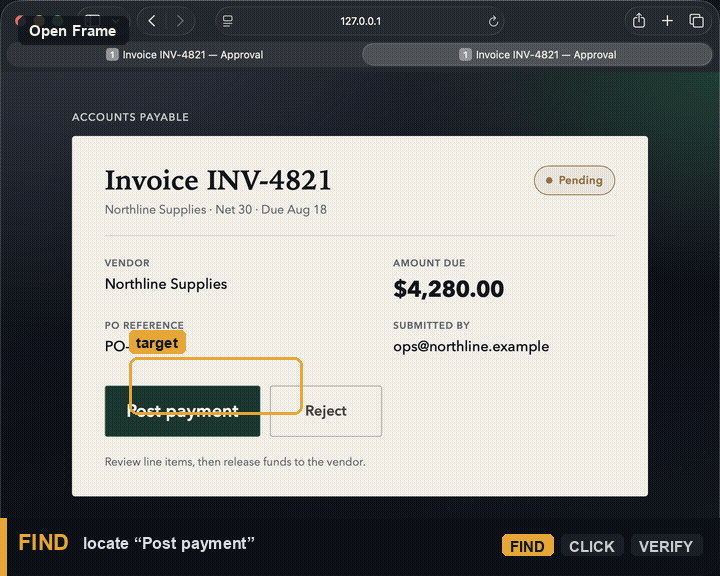

<p align="center">
  
</p>

# Open Frame

Open-source desktop automation engine for AI agents and scripts.

**Open Frame** sees what is on screen, finds targets, interacts with UI, and verifies outcomes. It is built to be deterministic, scriptable, and auditable.

<p align="center">
  
</p>

<sub>Above: Open Frame drives a live invoice UI — <strong>FIND</strong> “Post payment”, <strong>CLICK</strong> the match, <strong>VERIFY</strong> “Payment posted to Northline.”</sub>

> Open Frame is an independent project and is not affiliated with or endorsed by any third-party automation vendor.

Open Frame is the deterministic execution layer behind AI agents, not the agent itself.

### How this differs from assistant UX tools

- Open Frame executes deterministic capture/recognize/act/verify primitives.
- External LLM agents (or scripts) decide what tool call to make next.
- The engine returns compact structured outputs and artifact paths for debugging.

## Status

**Beta** (`v0.2.0`) — macOS-first. Available on PyPI as
[`off-camber-open-frame`](https://pypi.org/project/off-camber-open-frame/).
Evidence for this release comes from CI plus a local macOS live gate (including
MCP stdio smoke); see [release gates](docs/RELEASE_GATES.md). Changelog:
[CHANGELOG.md](CHANGELOG.md).

## Who this is for

- Developers automating desktop workflows.
- Teams who want agent-callable UI execution without bloating context windows.
- Contributors building recognizers, flows, or integrations.

## Quickstart (beta funnel)

### 1. Install

```bash
pip install "off-camber-open-frame[mcp,ocr,act,flow]"
brew install tesseract
```

On macOS, grant your terminal or IDE host **Screen Recording** and
**Accessibility** (System Settings → Privacy & Security), then restart that app.

### 2. Diagnose

```bash
open-frame doctor
```

All required checks should report `pass` (`overall: ok`). Optional extras that
are not installed show as `skip` and do not fail the report.

### 3. Connect an MCP client

Point Claude Desktop or Cursor at the stdio server:

```bash
open-frame mcp serve
```

Copy-paste client config: [MCP server setup](docs/MCP_SERVER.md).

### 4. Run a first flow

```bash
open-frame find "Submit" --json
open-frame run examples/flows/mcp-dry-run-wait/flow.yaml --dry-run --json
```

If `open-frame` is not on your PATH yet:

```bash
python -m openframe.cli doctor
```

## Local development (repo clone)

```bash
python3.11 -m venv .venv
source .venv/bin/activate
pip install -e ".[dev,ocr,act,flow,mcp]"
open-frame doctor
open-frame mcp list-tools --json
```

If `python3.11` is not available on a fresh macOS machine:

```bash
brew install python@3.11
```

## Next steps

- [MCP server setup](docs/MCP_SERVER.md) — Claude Desktop / Cursor config.
- [Flow setup](docs/FLOW_SETUP.md) — define and run YAML flows.
- [API](docs/API.md) — use `Session` and MCP-oriented integration guidance.
- [Act setup](docs/ACT_SETUP.md) and [Verify setup](docs/VERIFY_SETUP.md) — run safely with evidence.
- [Full docs index](docs/README.md) — contributor and planning docs.

## License

Apache License 2.0 — free to use, modify, and self-host. See [LICENSE](LICENSE).
