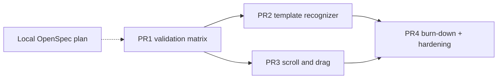

# Design: Beta Robustness Program

## Goals

- Measure real-app robustness before inventing more features
- Prefer deterministic recognition (template) over VLM for claim coverage
- Keep new flow/MCP surface thin and fail-closed
- Treat matrix failures as input to PR 4, not as blockers for shipping
  the measurement instrument itself

## Non-goals

- Replacing Tesseract or rewriting the agent layer
- Claiming multi-machine or multi-OS stability from one audited Mac
- Shipping a vision recognizer

## PR architecture

## Design decisions

### 1. App validation matrix (PR 1)

- Sibling script `scripts/app_matrix_gate.sh` rather than stuffing every
  probe into `macos_live_gate.sh`. The core live gate stays the fast
  calibration path; the matrix is optional/deeper.
- Probe flows under `examples/flows/app-matrix/<app>/flow.yaml`.
  Pattern per app: `app` activate → wait → `find` known label →
  `click` with `dry_run: true` → lightweight `verify` when safe.
- Non-destructive only: dry-run clicks, no compose/send/delete, no
  preference writes. Safari uses a stable public page (e.g. example.com
  or a local fixture HTML under `examples/demo/`).
- Report: JSON + markdown per-app rows (`pass` / `fail` / `skip`) with
  artifact paths. A failing app does not fail the PR merge of the
  matrix tooling — it seeds the PR 4 defect list.
- Target apps: Finder, Safari, Mail, System Settings, Notes, Calendar.

### 2. Template matching recognizer (PR 2)

- New package `src/openframe/recognize/template/` implementing
  `Recognizer`. Matching via normalized cross-correlation (Pillow +
  numpy). Prefer a dedicated `template` extra so core stays light;
  document install as `pip install -e '.[template]'` (or fold into
  `ocr` if numpy is already unavoidable — decide at implementation:
  default **new `template` extra**).
- Opt-in: callers pass `template` (path to PNG crop). Locator includes
  the template recognizer only when that param is present so default
  a11y+OCR behavior is unchanged.
- Coordinates: match in the captured frame's pixel space; emit targets
  with the same `coordinate_space` / `scale_factor` conventions as OCR
  so `select_target` parity holds at 1x and 2x.
- Confidence: correlation score mapped to `Target.confidence`; threshold
  configurable with a safe default. Fail closed on zero / ambiguous
  matches unless an explicit selector is provided.
- Live probe: an icon-only UI chrome target that OCR cannot read.

### 3. Scroll and drag (PR 3)

- `scroll` flow step wraps `Actuator.scroll` (amount + optional
  direction / point).
- `drag` adds `Actuator.drag` via pyautogui (from → to, or target →
  target / point).
- `scroll_until_found` as params on `find` / `click` (max attempts,
  scroll amount, poll interval) — bounded, never infinite.
- New MCP tool `scroll` registered in adapter + stdio server. Contract
  version bump only if we treat tool-set expansion as a label change
  (recommend bumping label to `v0.2.1` or `v0.3.0` in PR 4, not mid-PR 3,
  so PR 3 can land independently).
- Live probe: long Safari page; scroll until a below-fold label is found.

### 4. Robustness gates (PR 4)

- Burn down matrix defects that are local/fixable; park structural
  items (e.g. "needs Windows") as separate future OpenSpecs.
- MCP hardening: per-tool wall-clock timeout (especially `run_flow`),
  truncate large `data` payloads in favor of artifact paths, document
  single-client sequential semantics in `docs/MCP_SERVER.md`.
- Dogfooding log: short markdown evidence of real Claude Desktop / Cursor
  sessions.
- Version decision only after CI + live gate + app matrix + MCP
  repeatability + agent acceptance are green.

## Risks

| Risk | Mitigation |
|---|---|
| Matrix flaky due to app UI localization / dark mode | Prefer system-language-stable labels; record OS locale; allow skip with reason |
| Template matching false positives | High default threshold; require explicit selector on multi-match; fixture negatives |
| Scroll_until_found infinite loops | Hard max attempts; always record attempts in step details |
| numpy weight for template extra | Keep optional; document clearly |
| PR 2/3 conflict in runner/MCP | Small shared param plumbing; rebase frequently |

## Commit conventions inside each PR

1. failing test(s) / measurement harness first where practical
2. implementation
3. docs for that capability only
